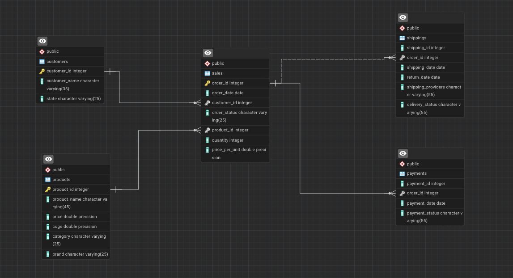

Flipkart Sales Database Project

This project contains a relational database schema designed to simulate Flipkart’s sales and operations. It includes Customers, Products, Sales, Payments, and Shipping tables, providing a structured dataset for learning, analysis, and reporting.

Key Features

With this database, you can:

📊 Track customer purchases and behavior

💰 Analyze product sales, profit margins, and revenue trends

💳 Monitor payment statuses and order fulfillment efficiency

🚚 Evaluate shipping performance and delivery timelines

This schema is ideal for:

SQL practice

Data analytics projects

Building dashboards for e-commerce insights

Database Schema
1.Customers

customer_id: Unique identifier for each customer

customer_name: Full name of the customer

state: State of residence

2.Products

product_id: Unique identifier for each product

product_name: Name of the product

price: Selling price of the product

cogs: Cost of goods sold

category: Product category (e.g., Electronics, Apparel)

brand: Brand of the product

3.Sales

order_id: Unique identifier for each order

order_date: Date when the order was placed

customer_id: Customer who placed the order

order_status: Status of the order (e.g., Completed, Cancelled)

product_id: Product included in the order

quantity: Number of units ordered

price_per_unit: Price of a single unit at the time of purchase

4.Payments

payment_id: Unique identifier for each payment

order_id: Associated order identifier

payment_date: Date when the payment was made

payment_status: Status of the payment (e.g., Completed, Pending, Failed)

5.Shippings

shipping_id: Unique identifier for each shipping record

order_id: Associated order identifier

shipping_date: Date when the order was shipped

return_date: Date when the order was returned (if applicable)

shipping_provider: Name of the delivery provider

delivery_status: Current status of delivery (e.g., Delivered, In Transit, Returned)

